# Flowcharts - Basic Syntax

<div id="jfjfgj">

<script src="../release/go.js"></script>
<div id="allSampleContent" class="p-4 w-full">
<script src="../extensions/HyperlinkText.js"></script>
<script id="code">

class PoolLayout extends go.GridLayout {
  constructor() {
    super();
    this.MINLENGTH = 200;
    this.MINBREADTH = 100;
    this.cellSize = new go.Size(1, 1);
    this.wrappingColumn = Infinity;
    this.wrappingWidth = Infinity;
    this.spacing = new go.Size(0, 0);
    this.alignment = go.GridLayout.Position;
  }

  doLayout(coll) {
    const diagram = this.diagram;
    if (diagram === null) return;
    diagram.startTransaction("PoolLayout");
    const minlen = this.computeMinPoolLength();
    diagram.findTopLevelGroups().each(lane => {
      if (!(lane instanceof go.Group)) return;
      const shape = lane.selectionObject;
      if (shape !== null) {  // change the desiredSize to be big enough in both directions
        const sz = this.computeLaneSize(lane);
        shape.width = (!isNaN(shape.width)) ? Math.max(shape.width, sz.width) : sz.width;
        // if you want the height of all of the lanes to shrink as the maximum needed height decreases:
        shape.height = minlen;
        // if you want the height of all of the lanes to remain at the maximum height ever needed:
        //shape.height = (isNaN(shape.height) ? minlen : Math.max(shape.height, minlen));
        const cell = lane.resizeCellSize;
        if (!isNaN(shape.width) && !isNaN(cell.width) && cell.width > 0) shape.width = Math.ceil(shape.width / cell.width) * cell.width;
        if (!isNaN(shape.height) && !isNaN(cell.height) && cell.height > 0) shape.height = Math.ceil(shape.height / cell.height) * cell.height;
      }
    });
     super.doLayout(coll);
    diagram.commitTransaction("PoolLayout");
  };

   computeMinPoolLength() {
    let len = this.MINLENGTH;
    myDiagram.findTopLevelGroups().each(lane => {
      const holder = lane.placeholder;
      if (holder !== null) {
        const sz = holder.actualBounds;
        len = Math.max(len, sz.height);
      }
    });
    return len;
  }

  computeLaneSize(lane) {
    const sz = new go.Size(lane.isSubGraphExpanded ? this.MINBREADTH : 1, this.MINLENGTH);
    if (lane.isSubGraphExpanded) {
      const holder = lane.placeholder;
      if (holder !== null) {
        const hsz = holder.actualBounds;
        sz.width = Math.max(sz.width, hsz.width);
      }
    }
     const hdr = lane.findObject("HEADER");
    if (hdr !== null) sz.width = Math.max(sz.width, hdr.actualBounds.width);
    return sz;
  }
}


function init() {

  const $ = go.GraphObject.make;

  myDiagram =
    $(go.Diagram, "myDiagramDiv",
      {
        contentAlignment: go.Spot.TopLeft,
        layout: $(PoolLayout),
        mouseDrop: e => {
          e.diagram.currentTool.doCancel();
        },
        "commandHandler.copiesGroupKey": true,
        "SelectionMoved": relayoutDiagram,  // this DiagramEvent listener is
        "SelectionCopied": relayoutDiagram, // defined above
        "undoManager.isEnabled": true,
        "textEditingTool.starting": go.TextEditingTool.SingleClick
      });

  myDiagram.toolManager.draggingTool.doActivate = function() {
    go.DraggingTool.prototype.doActivate.call(this);
    this.currentPart.opacity = 0.6;
    this.currentPart.layerName = "Foreground";
  }
  myDiagram.toolManager.draggingTool.doDeactivate = function() {
    this.currentPart.opacity = 1;
    this.currentPart.layerName = "";
    go.DraggingTool.prototype.doDeactivate.call(this);
  }

  function relayoutDiagram() {
    myDiagram.selection.each(n => n.invalidateLayout());
    myDiagram.layoutDiagram();
  }

  const noteColors = ['#009CCC', '#CC293D', '#FFD700'];
  function getNoteColor(num) {
    return noteColors[Math.min(num, noteColors.length - 1)];
  }

  myDiagram.nodeTemplate =
    $(go.Node, "Horizontal",
      new go.Binding("location", "loc", go.Point.parse).makeTwoWay(go.Point.stringify),
      $(go.Shape, "Rectangle", {
          fill: '#009CCC', strokeWidth: 1, stroke: '#009CCC',
          width: 6, stretch: go.GraphObject.Vertical, alignment: go.Spot.Left,
          // if a user clicks the colored portion of a node, cycle through colors
          click: (e, obj) => {
            myDiagram.startTransaction("Update node color");
            let newColor = parseInt(obj.part.data.color) + 1;
            if (newColor > noteColors.length - 1) newColor = 0;
            myDiagram.model.setDataProperty(obj.part.data, "color", newColor);
            myDiagram.commitTransaction("Update node color");
          }
        },
        new go.Binding("fill", "color", getNoteColor),
        new go.Binding("stroke", "color", getNoteColor)
      ),
      $(go.Panel, "Auto",
        $(go.Shape, "Rectangle", { fill: "white", stroke: '#CCCCCC' }),

$(go.Panel, "Table",
  { width: 100, minSize: new go.Size(NaN, 50) },

  // $(go.TextBlock,
  //   {
  //     name: 'TEXT',
  //
  //     margin: 6, font: '11px Lato, sans-serif', editable: true,
  //     stroke: "#000", maxSize: new go.Size(130, NaN),
  //     alignment: go.Spot.TopLeft
  //   },
  //   new go.Binding("text", "text").makeTwoWay()),
  $("HyperlinkText",
    TextBlock =>  "https://" + encodeURIComponent(TextBlock.data.url),
    TextBlock => TextBlock.data.text,
    { margin: 1, maxSize: new go.Size(80, 80), textAlign: "center" })
),

),

);

  function save() {
    document.getElementById("mySavedModel").value.name = myDiagram.model.toJson();
    myDiagram.isModified = false;
  }

  // While dragging, highlight the dragged-over group
  function highlightGroup(grp, show) {
    if (show) {
      const part = myDiagram.toolManager.draggingTool.currentPart;
      if (part.containingGroup !== grp) {
        grp.isHighlighted = true;
        return;
      }
    }
    grp.isHighlighted = false;
  }

  myDiagram.groupTemplate =
    $(go.Group, "Vertical",
      {
        selectable: false,
        selectionObjectName: "SHAPE", // even though its not selectable, this is used in the layout
        layerName: "Background",  // all lanes are always behind all nodes and links
        layout: $(go.GridLayout,  // automatically lay out the lane's subgraph
          {
            wrappingColumn: 1,
            cellSize: new go.Size(1, 1),
            spacing: new go.Size(5, 5),
            alignment: go.GridLayout.Position,
            comparer: (a, b) => {  // can re-order tasks within a lane
              const ay = a.location.y;
              const by = b.location.y;
              if (isNaN(ay) || isNaN(by)) return 0;
              if (ay < by) return -1;
              if (ay > by) return 1;
              return 0;
            }
          }),
        click: (e, grp) => {  // allow simple click on group to clear selection
          if (!e.shift && !e.control && !e.meta) e.diagram.clearSelection();
        },
        computesBoundsAfterDrag: true,  // needed to prevent recomputing Group.placeholder bounds too soon
        handlesDragDropForMembers: true,  // don't need to define handlers on member Nodes and Links
        mouseDragEnter: (e, grp, prev) => highlightGroup(grp, true),
        mouseDragLeave: (e, grp, next) => highlightGroup(grp, false),
        mouseDrop: (e, grp) => {  // dropping a copy of some Nodes and Links onto this Group adds them to this Group
          // don't allow drag-and-dropping a mix of regular Nodes and Groups
          if (e.diagram.selection.all(n => !(n instanceof go.Group))) {
            const ok = grp.addMembers(grp.diagram.selection, true);
            if (!ok) grp.diagram.currentTool.doCancel();
          }
        },
        subGraphExpandedChanged: grp => {
          const shp = grp.selectionObject;
          if (grp.diagram.undoManager.isUndoingRedoing) return;
          if (grp.isSubGraphExpanded) {
            shp.width = grp.data.savedBreadth;
          } else {  // remember the original width
            if (!isNaN(shp.width)) grp.diagram.model.set(grp.data, "savedBreadth", shp.width);
            shp.width = NaN;
          }
        }
      },
      new go.Binding("location", "loc", go.Point.parse).makeTwoWay(go.Point.stringify),
      new go.Binding("isSubGraphExpanded", "expanded").makeTwoWay(),
      // the lane header consisting of a TextBlock and an expander button
      $(go.Panel, "Horizontal",
        { name: "HEADER", alignment: go.Spot.Left },
        $("SubGraphExpanderButton", { margin: 5 }),  // this remains always visible
        $(go.TextBlock,  // the lane label
          { font: "15px Lato, sans-serif", editable: true, margin: new go.Margin(2, 0, 0, 0) },
          // this is hidden when the swimlane is collapsed
          new go.Binding("visible", "isSubGraphExpanded").ofObject(),
          new go.Binding("text").makeTwoWay())
      ),  // end Horizontal Panel
      $(go.Panel, "Auto",  // the lane consisting of a background Shape and a Placeholder representing the subgraph
        $(go.Shape, "Rectangle",  // this is the resized object
          { name: "SHAPE", fill: "#F1F1F1", stroke: null, strokeWidth: 4 },  // strokeWidth controls space between lanes
          new go.Binding("fill", "isHighlighted", h => h ? "#D6D6D6" : "#F1F1F1").ofObject(),
          new go.Binding("desiredSize", "size", go.Size.parse).makeTwoWay(go.Size.stringify)),
        $(go.Placeholder,
          { padding: 12, alignment: go.Spot.TopLeft }),
        $(go.TextBlock,  // this TextBlock is only seen when the swimlane is collapsed
          {
            name: "LABEL", font: "15px Lato, sans-serif", editable: true,
            angle: 90, alignment: go.Spot.TopLeft, margin: new go.Margin(4, 0, 0, 2)
          },
          new go.Binding("visible", "isSubGraphExpanded", e => !e).ofObject(),
          new go.Binding("text").makeTwoWay())
      )  // end Auto Panel
    );  // end Group

  // Set up an unmodeled Part as a legend, and place it directly on the diagram.
  myDiagram.add(
    $(go.Part, "Table",
      { position: new go.Point(10, 10), selectable: false },
      $(go.TextBlock, "Key",
        { row: 0, font: "700 14px Droid Serif, sans-serif" }),  // end row 0
      $(go.Panel, "Horizontal",
        { row: 1, alignment: go.Spot.Left },
        $(go.Shape, "Rectangle",
          { desiredSize: new go.Size(10, 10), fill: '#CC293D', margin: 5 }),
        $(go.TextBlock, "Halted",
          { font: "700 13px Droid Serif, sans-serif" })
      ),  // end row 1
      $(go.Panel, "Horizontal",
        { row: 2, alignment: go.Spot.Left },
        $(go.Shape, "Rectangle",
          { desiredSize: new go.Size(10, 10), fill: '#FFD700', margin: 5 }),
        $(go.TextBlock, "In Progress",
          { font: "700 13px Droid Serif, sans-serif" })
      ),  // end row 2
      $(go.Panel, "Horizontal",
        { row: 3, alignment: go.Spot.Left },
        $(go.Shape, "Rectangle",
          { desiredSize: new go.Size(10, 10), fill: '#009CCC', margin: 5 }),
        $(go.TextBlock, "Completed",
          { font: "700 13px Droid Serif, sans-serif" })
      ),  // end row 3
      $(go.Panel, "Horizontal",
        {
          row: 4,
          click: (e, node) => {
            e.diagram.startTransaction('add node');
            let sel = e.diagram.selection.first();
            if (!sel) sel = e.diagram.findTopLevelGroups().first();
            if (!(sel instanceof go.Group)) sel = sel.containingGroup;
            if (!sel) return;
            const newdata = { group: sel.key, loc: "0 9999", text: "New item " + sel.memberParts.count, color: 0 };
            e.diagram.model.addNodeData(newdata);
            e.diagram.commitTransaction('add node');
            const newnode = myDiagram.findNodeForData(newdata);
            e.diagram.select(newnode);
            e.diagram.commandHandler.editTextBlock();
            e.diagram.commandHandler.scrollToPart(newnode);
          },
          background: 'white',
          margin: new go.Margin(10, 4, 4, 4)
        },
        $(go.Panel, "Auto",
          $(go.Shape, "Rectangle", { strokeWidth: 0, stroke: null, fill: '#6FB583' }),
          $(go.Shape, "PlusLine", { margin: 6, strokeWidth: 2, width: 12, height: 12, stroke: 'white', background: '#6FB583' })
        ),
        $(go.TextBlock, "New item", { font: '10px Lato, sans-serif', margin: 6, })
      )
    )
  );

  load();

}  // end init

// Show the diagram's model in JSON format
function save() {
  document.getElementById("mySavedModel").value = myDiagram.model.toJson();
  myDiagram.isModified = false;
}
function load() {
  myDiagram.model = go.Model.fromJson(document.getElementById("mySavedModel").value);
}
window.addEventListener('DOMContentLoaded', init);
  </script>

  <div id="sample">
    <div id="myDiagramDiv" style="border: solid 1px black; width:100%; height:500px;"></div>
    <p>A Kanban board is a work and workflow visualization used to communicate the status and progress of work items. Click on the color of a note to cycle through colors.</p>
    <p>
      This design and implementation were adapted from the <a href="swimLanesVertical.html">Swim Lanes (vertical)</a> sample.
      Unlike that sample:
    <ul>
      <li>there are no Links</li>
      <li>lanes cannot be nested into "pools"</li>
      <li>lanes cannot be resized</li>
      <li>the user cannot drop tasks into the diagram's background</li>
      <li>all tasks are ordered within a single column; the user can rearrange the order</li>
      <li>tasks can freely be moved into other lanes</li>
      <li>lanes are not movable or copyable or deletable</li>
    </ul>
    </p>
    <button id="SaveButton" onclick="save()">Save</button>
    <button onclick="load()">Load</button>
    Diagram Model saved in JSON format:
    <br />
    <textarea id="mySavedModel" style="width:100%;height:300px">
{ "class": "go.GraphLinksModel",
  "nodeDataArray": [
{"key":"Problems", "text":"Problems", "isGroup":true, "loc":"0 23.52284749830794" },
{"key":"Reproduced", "text":"Reproduced", "isGroup":true, "color":"0", "loc":"109 23.52284749830794" },
{"key":"Identified", "text":"Identified", "isGroup":true, "color":"0", "loc":"235 23.52284749830794" },
{"key":"Fixing", "text":"Fixing", "isGroup":true, "color":"0", "loc":"343 23.52284749830794" },
{"key":"Reviewing", "text":"Reviewing", "isGroup":true, "color":"0", "loc":"451 23.52284749830794"},
{"key":"Testing", "text":"Testing", "isGroup":true, "color":"0", "loc":"562 23.52284749830794" },
{"key":"Customer", "text":"Customer", "isGroup":true, "color":"0", "loc":"671 23.52284749830794" },
{"key":-1, "group":"Problems", "category":"newbutton",  "loc":"12 35.52284749830794" },
{"key":1, "text":"text for oneA", "url":"naver.com", "group":"Problems", "color":"0", "loc":"12 35.52284749830794"},
{"key":2, "text":"text for oneB", "url":"naver.com", "group":"Problems", "color":"1", "loc":"12 65.52284749830794"},
{"key":3, "text":"text for oneC", "url":"naver.com", "group":"Problems", "color":"0", "loc":"12 95.52284749830794"},
{"key":4, "text":"text for oneD", "url":"naver.com", "group":"Problems", "color":"1", "loc":"12 125.52284749830794"},
{"key":5, "text":"text for twoA", "group":"Reproduced", "color":"1", "loc":"121 35.52284749830794"},
{"key":6, "text":"text for twoB", "group":"Reproduced", "color":"1", "loc":"121 65.52284749830794"},
{"key":7, "text":"text for twoC", "group":"Identified", "color":"0", "loc":"247 35.52284749830794"},
{"key":8, "text":"text for twoD", "group":"Fixing", "color":"0", "loc":"355 35.52284749830794"},
{"key":9, "text":"text for twoE", "group":"Reviewing", "color":"0", "loc":"463 35.52284749830794"},
{"key":10, "text":"text for twoF", "group":"Reviewing", "color":"1", "loc":"463 65.52284749830794"},
{"key":11, "text":"text for twoG", "group":"Testing", "color":"0", "loc":"574 35.52284749830794"},
{"key":12, "text":"text for fourA", "group":"Customer", "color":"1", "loc":"683 35.52284749830794"},
{"key":13, "text":"text for fourB", "group":"Customer", "color":"1", "loc":"683 65.52284749830794"},
{"key":14, "text":"text for fourC", "group":"Customer", "color":"1", "loc":"683 95.52284749830794"},
{"key":15, "text":"text for fourD", "group":"Customer", "color":"0", "loc":"683 125.52284749830794"},
{"key":16, "text":"text for fiveA", "group":"Customer", "color":"0", "loc":"683 155.52284749830795"}
],
  "linkDataArray": []}
  </textarea>
  </div>
</div>
<!-- * * * * * * * * * * * * * -->
<!--  End of GoJS sample code  -->

</div>

**Edit this Page** [](https://github.com/mermaid-js/mermaid/blob/develop/docs/flowchart.md)

All Flowcharts are composed of **nodes**, the geometric shapes and **edges**, the arrows or lines. The mermaid code defines the way that these **nodes** and **edges** are made and interact.

It can also accommodate different arrow types, multi directional arrows, and linking to and from subgraphs.

> **Important note**: Do not type the word "end" as a Flowchart node. Capitalize all or any one the letters to keep the flowchart from breaking, i.e, "End" or "END". Or you can apply this [workaround](https://github.com/mermaid-js/mermaid/issues/1444#issuecomment-639528897).**

### A node (default)

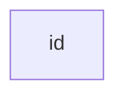

> **Note** The id is what is displayed in the box.

### A node with text

It is also possible to set text in the box that differs from the id. If this is done several times, it is the last text
found for the node that will be used. Also if you define edges for the node later on, you can omit text definitions. The
one previously defined will be used when rendering the box.

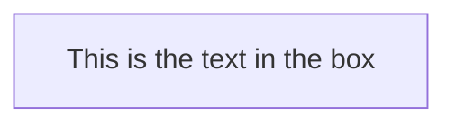

## Graph

This statement declares the direction of the Flowchart.

This declares the flowchart is oriented from top to bottom (`TD` or `TB`).

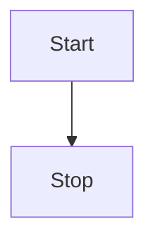

This declares the flowchart is oriented from left to right (`LR`).

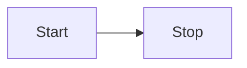

## Flowchart Orientation

Possible FlowChart orientations are:

* TB - top to bottom
* TD - top-down/ same as top to bottom
* BT - bottom to top
* RL - right to left
* LR - left to right

## Node shapes

### A node with round edges

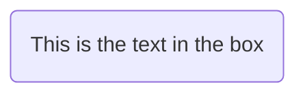

### A stadium-shaped node

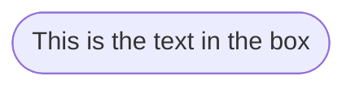

### A node in a subroutine shape

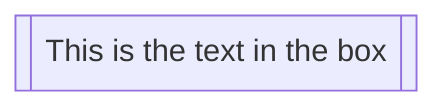

### A node in a cylindrical shape

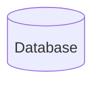

### A node in the form of a circle

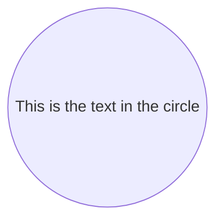

### A node in an asymmetric shape

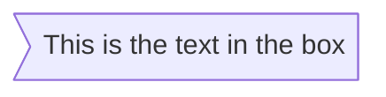
Currently only the shape above is possible and not its mirror. *This might change with future releases.*

### A node (rhombus)

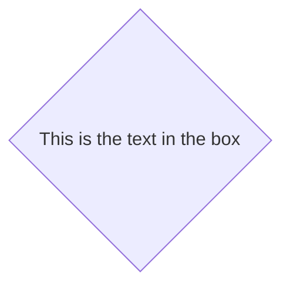

### A hexagon node
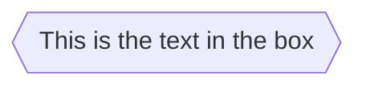

### Parallelogram

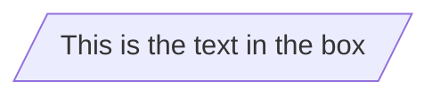

### Parallelogram alt

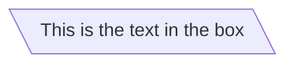

### Trapezoid

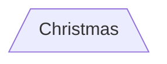
### Trapezoid alt

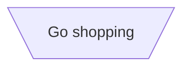

### Double circle

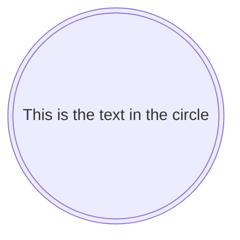

## Links between nodes

Nodes can be connected with links/edges. It is possible to have different types of links or attach a text string to a link.

### A link with arrow head

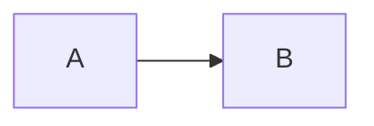

### An open link

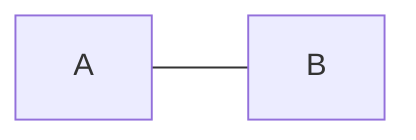

### Text on links

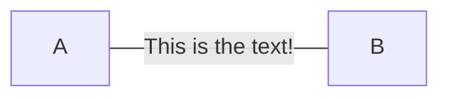

or

```mermaid
flowchart LR
    A---|This is the text|B
```

### A link with arrow head and text

```mermaid
flowchart LR
    A-->|text|B
```

or

```mermaid
flowchart LR
    A-- text -->B
```

### Dotted link

```mermaid
flowchart LR;
   A-.->B;
```

### Dotted link with text

```mermaid
flowchart LR
   A-. text .-> B
```

### Thick link

```mermaid
flowchart LR
   A ==> B
```

### Thick link with text

```mermaid
flowchart LR
   A == text ==> B
```

### Chaining of links

It is possible declare many links in the same line as per below:
```mermaid
flowchart LR
   A -- text --> B -- text2 --> C
```

It is also possible to declare multiple nodes links in the same line as per below:
```mermaid
flowchart LR
   a --> b & c--> d
```

You can then describe dependencies in a very expressive way. Like the one-liner below:
```mermaid
flowchart TB
    A & B--> C & D
```
If you describe the same diagram using the the basic syntax, it will take four lines. A
word of warning, one could go overboard with this making the flowchart harder to read in
markdown form. The Swedish word `lagom` comes to mind. It means, not too much and not too little.
This goes for expressive syntaxes as well.
```mmd
flowchart TB
    A --> C
    A --> D
    B --> C
    B --> D
```

### New arrow types

There are new types of arrows supported as per below:

```mermaid
flowchart LR
    A --o B
    B --x C
```


### Multi directional arrows

There is the possibility to use multidirectional arrows.

```mermaid
flowchart LR
    A o--o B
    B <--> C
    C x--x D
```

### Minimum length of a link

Each node in the flowchart is ultimately assigned to a rank in the rendered
graph, i.e. to a vertical or horizontal level (depending on the flowchart
orientation), based on the nodes to which it is linked. By default, links
can span any number of ranks, but you can ask for any link to be longer
than the others by adding extra dashes in the link definition.

In the following example, two extra dashes are added in the link from node _B_
to node _E_, so that it spans two more ranks than regular links:

```mermaid
flowchart TD
    A[Start] --> B{Is it?}
    B -->|Yes| C[OK]
    C --> D[Rethink]
    D --> B
    B ---->|No| E[End]
```

> **Note** Links may still be made longer than the requested number of ranks
> by the rendering engine to accommodate other requests.

When the link label is written in the middle of the link, the extra dashes must
be added on the right side of the link. The following example is equivalent to
the previous one:

```mermaid
flowchart TD
    A[Start] --> B{Is it?}
    B -- Yes --> C[OK]
    C --> D[Rethink]
    D --> B
    B -- No ----> E[End]
```

For dotted or thick links, the characters to add are equals signs or dots,
as summed up in the following table:

| Length            |    1   |    2    |     3    |
|-------------------|:------:|:-------:|:--------:|
| Normal            |  `---` |  `----` |  `-----` |
| Normal with arrow |  `-->` |  `--->` |  `---->` |
| Thick             |  `===` |  `====` |  `=====` |
| Thick with arrow  |  `==>` |  `===>` |  `====>` |
| Dotted            | `-.-`  | `-..-`  | `-...-`  |
| Dotted with arrow | `-.->` | `-..->` | `-...->` |

## Special characters that break syntax

It is possible to put text within quotes in order to render more troublesome characters. As in the example below:

```mermaid
flowchart LR
    id1["This is the (text) in the box"]
```

### Entity codes to escape characters

It is possible to escape characters using the syntax exemplified here.

```mermaid
    flowchart LR
        A["A double quote:#quot;"] -->B["A dec char:#9829;"]
```

Numbers given are base 10, so `#` can be encoded as `#35;`. It is also supported to use HTML character names.

## Subgraphs

```
subgraph title
    graph definition
end
```

An example below:

```mermaid
flowchart TB
    c1-->a2
    subgraph one
    a1-->a2
    end
    subgraph two
    b1-->b2
    end
    subgraph three
    c1-->c2
    end
 ```

 You can also set an explicit id for the subgraph.

```mermaid
flowchart TB
    c1-->a2
    subgraph ide1 [one]
    a1-->a2
    end
 ```

## flowcharts

With the graphtype flowchart it is also possible to set edges to and from subgraphs as in the flowchart below.

```mermaid
flowchart TB
    c1-->a2
    subgraph one
    a1-->a2
    end
    subgraph two
    b1-->b2
    end
    subgraph three
    c1-->c2
    end
    one --> two
    three --> two
    two --> c2
 ```

 ## Direction in subgraphs

With the graphtype flowcharts you can use the direction statement to set the direction which the subgraph will render like in this example.

```mermaid
flowchart LR
  subgraph TOP
    direction TB
    subgraph B1
        direction RL
        i1 -->f1
    end
    subgraph B2
        direction BT
        i2 -->f2
    end
  end
  A --> TOP --> B
  B1 --> B2
 ```

## Interaction

It is possible to bind a click event to a node, the click can lead to either a javascript callback or to a link which will be opened in a new browser tab. **Note**: This functionality is disabled when using `securityLevel='strict'` and enabled when using `securityLevel='loose'`.

```
click nodeId callback
click nodeId call callback()
```

* nodeId is the id of the node
* callback is the name of a javascript function defined on the page displaying the graph, the function will be called with the nodeId as parameter.

Examples of tooltip usage below:

```html
<script>
  var callback = function () {
      alert('A callback was triggered');
  };
</script>
```

The tooltip text is surrounded in double quotes. The styles of the tooltip are set by the class `.mermaidTooltip`.

```mermaid
flowchart LR
    A-->B
    B-->C
    C-->D
    click A callback "Tooltip for a callback"
    click B "https://www.github.com" "This is a tooltip for a link"
    click A call callback() "Tooltip for a callback"
    click B href "https://www.github.com" "This is a tooltip for a link"
```

> **Success** The tooltip functionality and the ability to link to urls are available from version 0.5.2.

?> Due to limitations with how Docsify handles JavaScript callback functions, an alternate working demo for the above code can be viewed at [this jsfiddle](https://jsfiddle.net/s37cjoau/3/).

Links are opened in the same browser tab/window by default. It is possible to change this by adding a link target to the click definition (`_self`, `_blank`, `_parent` and `_top` are supported):
```mermaid
flowchart LR
    A-->B
    B-->C
    C-->D
    D-->E
    click A "https://www.github.com" _blank
    click B "https://www.github.com" "Open this in a new tab" _blank
    click C href "https://www.github.com" _blank
    click D href "https://www.github.com" "Open this in a new tab" _blank
```

Beginners tip, a full example using interactive links in a html context:
```html
<body>
  <div class="mermaid">
    flowchart LR
        A-->B
        B-->C
        C-->D
        click A callback "Tooltip"
        click B "https://www.github.com" "This is a link"
        click C call callback() "Tooltip"
        click D href "https://www.github.com" "This is a link"
  </div>

  <script>
    var callback = function () {
        alert('A callback was triggered');
    };
    var config = {
        startOnLoad: true,
        flowchart: { useMaxWidth: true, htmlLabels: true, curve: 'cardinal' },
        securityLevel:'loose'
    };
    mermaid.initialize(config);
  </script>
</body>
```

### Comments

Comments can be entered within a flow diagram, which will be ignored by the parser.  Comments need to be on their own line, and must be prefaced with `%%` (double percent signs). Any text after the start of the comment to the next newline will be treated as a comment, including any flow syntax

```mmd
flowchart LR
%% this is a comment A -- text --> B{node}
   A -- text --> B -- text2 --> C
```

## Styling and classes

### Styling links

It is possible to style links. For instance you might want to style a link that is going backwards in the flow. As links
have no ids in the same way as nodes, some other way of deciding what style the links should be attached to is required.
Instead of ids, the order number of when the link was defined in the graph is used, or use default to apply to all links.
In the example below the style defined in the linkStyle statement will belong to the fourth link in the graph:

```
linkStyle 3 stroke:#ff3,stroke-width:4px,color:red;
```


### Styling a node

It is possible to apply specific styles such as a thicker border or a different background color to a node.

```mermaid
flowchart LR
    id1(Start)-->id2(Stop)
    style id1 fill:#f9f,stroke:#333,stroke-width:4px
    style id2 fill:#bbf,stroke:#f66,stroke-width:2px,color:#fff,stroke-dasharray: 5 5
```


#### Classes

More convenient than defining the style every time is to define a class of styles and attach this class to the nodes that
should have a different look.

a class definition looks like the example below:


```
    classDef className fill:#f9f,stroke:#333,stroke-width:4px;
```

Attachment of a class to a node is done as per below:

```
    class nodeId1 className;
```

It is also possible to attach a class to a list of nodes in one statement:

```
    class nodeId1,nodeId2 className;
```

A shorter form of adding a class is to attach the classname to the node using the `:::`operator as per below:

```mermaid
flowchart LR
    A:::someclass --> B
    classDef someclass fill:#f96;
```


### Css classes

It is also possible to predefine classes in css styles that can be applied from the graph definition as in the example
below:

**Example style**

```html
<style>
    .cssClass > rect{
        fill:#FF0000;
        stroke:#FFFF00;
        stroke-width:4px;
    }
</style>
```

**Example definition**

```mermaid
flowchart LR;
    A-->B[AAA<span>BBB</span>]
    B-->D
    class A cssClass
```


### Default class

If a class is named default it will be assigned to all classes without specific class definitions.

```
    classDef default fill:#f9f,stroke:#333,stroke-width:4px;
```


## Basic support for fontawesome

It is possible to add icons from fontawesome.

The icons are accessed via the syntax fa:#icon class name#.

```mermaid
flowchart TD
    B["fab:fa-twitter for peace"]
    B-->C[fa:fa-ban forbidden]
    B-->D(fa:fa-spinner);
    B-->E(A fa:fa-camera-retro perhaps?)
```

?> Mermaid is now only compatible with Font Awesome versions 4 and 5. Check that you are using the correct version of Font Awesome.


## Graph declarations with spaces between vertices and link and without semicolon

* In graph declarations, the statements also can now end without a semicolon. After release 0.2.16, ending a graph statement with semicolon is just optional. So the below graph declaration is also valid along with the old declarations of the graph.

* A single space is allowed between vertices and the link. However there should not be any space between a vertex and its text and a link and its text. The old syntax of graph declaration will also work and hence this new feature is optional and is introduced to improve readability.

Below is the new declaration of the graph edges which is also valid along with the old declaration of the graph edges.

```mermaid
flowchart LR
    A[Hard edge] -->|Link text| B(Round edge)
    B --> C{Decision}
    C -->|One| D[Result one]
    C -->|Two| E[Result two]
```


## Configuration...

Is it possible to adjust the width of the rendered flowchart.

This is done by defining **mermaid.flowchartConfig** or by the CLI to use a JSON file with the configuration. How to use the CLI is described in the mermaidCLI page.
mermaid.flowchartConfig can be set to a JSON string with config parameters or the corresponding object.

```javascript
mermaid.flowchartConfig = {
    width: 100%
}
```
