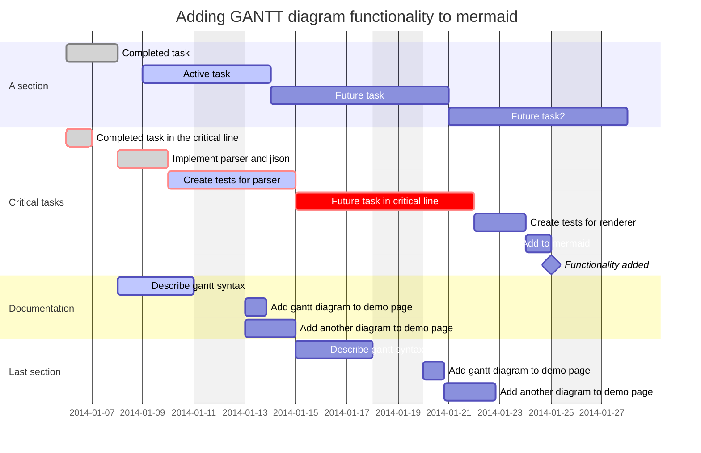

# asus-linux.org.md in new_start folder

efef


<!-- * * * * * * * * * * * * * -->
<!-- Start of GoJS sample code -->

<script src="../../release/go.js"></script>
<div id="allSampleContent" class="p-4 w-full">
<script id="code">
function init() {
if (window.goSamples) goSamples();
const $ = go.GraphObject.make;
myDiagram =
  $(go.Diagram, "myDiagramDiv",
    {
      "LinkDrawn": showLinkLabel,
      "LinkRelinked": showLinkLabel,
      "undoManager.isEnabled": true
    });

myDiagram.addDiagramListener("Modified", e => {
var button = document.getElementById("SaveButton");
if (button) button.disabled = !myDiagram.isModified;
var idx = document.title.indexOf("*");
if (myDiagram.isModified) {
if (idx < 0) document.title += "*";
} else {
if (idx >= 0) document.title = document.title.slice(0, idx);
}
});


function nodeStyle() {
return[
new go.Binding("location", "loc", go.Point.parse).makeTwoWay(go.Point.stringify),
{locationSpot: go.Spot.Center}];
}

function makePort(name, align, spot, output, input) {
var horizontal = align.equals(go.Spot.Top) || align.equals(go.Spot.Bottom);
return $(go.Shape,
{
fill: "transparent",
strokeWidth: 0,
width: horizontal ? NaN : 8,
height: !horizontal ? NaN : 8,
alignment: align,
stretch: (horizontal ? go.GraphObject.Horizontal : go.GraphObject.Vertical),
portId: name,
fromSpot: spot,
fromLinkable: output,
toSpot: spot,
toLinkable: input,
cursor: "pointer",
mouseEnter: (e, port) => {
if (!e.diagram.isReadOnly) port.fill = "rgba(255,0,255,0.5)";
},
mouseLeave: (e, port) => port.fill = "transparent"
});
}

function textStyle() {
return {
font: "bold 11pt Lato, Helvetica, Arial, sans-serif",
stroke: "#F8F8F8"
}
}


myDiagram.nodeTemplateMap.add("",
$(go.Node, "Table", nodeStyle(),

$(go.Panel, "Auto",
  $(go.Shape, "Rectangle",
    { fill: "#282c34", stroke: "#00A9C9", strokeWidth: 3.5 },
    new go.Binding("figure", "figure")),
  $(go.TextBlock, textStyle(),
{
  margin: 8,
  maxSize: new go.Size(160, NaN),
  wrap: go.TextBlock.WrapFit,
  editable: true
},
new go.Binding("text").makeTwoWay())
),
makePort("T", go.Spot.Top, go.Spot.TopSide, false, true),
makePort("L", go.Spot.Left, go.Spot.LeftSide, true, true),
makePort("R", go.Spot.Right, go.Spot.RightSide, true, true),
makePort("B", go.Spot.Bottom, go.Spot.BottomSide, true, false)
));

myDiagram.nodeTemplateMap.add("Conditional",
$(go.Node, "Table", nodeStyle(),

$(go.Panel, "Auto",
  $(go.Shape, "Diamond",
    { fill: "#282c34", stroke: "#00A9C9", strokeWidth: 3.5 },
    new go.Binding("figure", "figure")),
  $(go.TextBlock, textStyle(),
    {
      margin: 8,
      maxSize: new go.Size(160, NaN),
      wrap: go.TextBlock.WrapFit,
      editable: true
    },
    new go.Binding("text").makeTwoWay())
),
makePort("T", go.Spot.Top, go.Spot.Top, false, true),
makePort("L", go.Spot.Left, go.Spot.Left, true, true),
makePort("R", go.Spot.Right, go.Spot.Right, true, true),
makePort("B", go.Spot.Bottom, go.Spot.Bottom, true, false)
));

myDiagram.nodeTemplateMap.add("Start",
$(go.Node, "Table", nodeStyle(),
$(go.Panel, "Spot",
$(go.Shape, "Circle",
{ desiredSize: new go.Size(70, 70), fill: "#282c34", stroke: "#09d3ac", strokeWidth: 3.5 }),
$(go.TextBlock, "Start", textStyle(),
new go.Binding("text"))
),
makePort("L", go.Spot.Left, go.Spot.Left, true, false),
makePort("R", go.Spot.Right, go.Spot.Right, true, false),
makePort("B", go.Spot.Bottom, go.Spot.Bottom, true, false)
));

myDiagram.nodeTemplateMap.add("End",
$(go.Node, "Table", nodeStyle(),
$(go.Panel, "Spot",
$(go.Shape, "Circle",
{ desiredSize: new go.Size(60, 60), fill: "#282c34", stroke: "#DC3C00", strokeWidth: 3.5 }),
$(go.TextBlock, "End", textStyle(),
new go.Binding("text"))
),
makePort("T", go.Spot.Top, go.Spot.Top, false, true),
makePort("L", go.Spot.Left, go.Spot.Left, false, true),
makePort("R", go.Spot.Right, go.Spot.Right, false, true)
));

go.Shape.defineFigureGenerator("File", (shape, w, h) => {
var geo = new go.Geometry();
var fig = new go.PathFigure(0, 0, true); //
geo.add(fig);
fig.add(new go.PathSegment(go.PathSegment.Line, .75 * w, 0));
fig.add(new go.PathSegment(go.PathSegment.Line, w, .25 * h));
fig.add(new go.PathSegment(go.PathSegment.Line, w, h));
fig.add(new go.PathSegment(go.PathSegment.Line, 0, h).close());
var fig2 = new go.PathFigure(.75 * w, 0, false);
geo.add(fig2);
// The Fold
fig2.add(new go.PathSegment(go.PathSegment.Line, .75 * w, .25 * h));
fig2.add(new go.PathSegment(go.PathSegment.Line, w, .25 * h));
geo.spot1 = new go.Spot(0, .25);
geo.spot2 = go.Spot.BottomRight;
return geo;
});

myDiagram.nodeTemplateMap.add("Comment",
$(go.Node, "Auto", nodeStyle(),
$(go.Shape, "File",
{ fill: "#282c34", stroke: "#DEE0A3", strokeWidth: 3 }),
$(go.TextBlock, textStyle(),
{
margin: 8,
maxSize: new go.Size(200, NaN),
wrap: go.TextBlock.WrapFit,
textAlign: "center",
editable: true
},
new go.Binding("text").makeTwoWay())
));


myDiagram.linkTemplate =
$(go.Link,
{
routing: go.Link.AvoidsNodes,
curve: go.Link.JumpOver,
corner: 5, toShortLength: 4,
relinkableFrom: true,
relinkableTo: true,
reshapable: true,
resegmentable: true,
mouseEnter: (e, link) => link.findObject("HIGHLIGHT").stroke = "rgba(30,144,255,0.2)",
mouseLeave: (e, link) => link.findObject("HIGHLIGHT").stroke = "transparent",
selectionAdorned: false
},
new go.Binding("points").makeTwoWay(),
$(go.Shape,
{ isPanelMain: true, strokeWidth: 8, stroke: "transparent", name: "HIGHLIGHT" }),
$(go.Shape,
{ isPanelMain: true, stroke: "gray", strokeWidth: 2 },
new go.Binding("stroke", "isSelected", sel => sel ? "dodgerblue" : "gray").ofObject()),
$(go.Shape,
{ toArrow: "standard", strokeWidth: 0, fill: "gray" }),
$(go.Panel, "Auto",
{ visible: false, name: "LABEL", segmentIndex: 2, segmentFraction: 0.5 },
new go.Binding("visible", "visible").makeTwoWay(),
$(go.Shape, "RoundedRectangle",  // the label shape
{ fill: "#F8F8F8", strokeWidth: 0 }),
$(go.TextBlock, "Yes",
{
textAlign: "center",
font: "10pt helvetica, arial, sans-serif",
stroke: "#333333",
editable: true
},
new go.Binding("text").makeTwoWay())
)
);

function showLinkLabel(e) {
var label = e.subject.findObject("LABEL");
if (label !== null) label.visible = (e.subject.fromNode.data.category === "Conditional");
}

myDiagram.toolManager.linkingTool.temporaryLink.routing = go.Link.Orthogonal;
myDiagram.toolManager.relinkingTool.temporaryLink.routing = go.Link.Orthogonal;

load();


myPalette =
$(go.Palette, "myPaletteDiv",
{

"animationManager.initialAnimationStyle": go.AnimationManager.None,
"InitialAnimationStarting": animateFadeDown,

nodeTemplateMap: myDiagram.nodeTemplateMap,
model: new go.GraphLinksModel([
{ category: "Start", text: "Start" },
{ text: "Step" },
{ category: "Conditional", text: "???" },
{ category: "End", text: "End" },
{ category: "Comment", text: "Comment" }
])
});

function animateFadeDown(e) {
var diagram = e.diagram;
var animation = new go.Animation();
animation.isViewportUnconstrained = true;
animation.easing = go.Animation.EaseOutExpo;
animation.duration = 900;
animation.add(diagram, 'position', diagram.position.copy().offset(0, 200), diagram.position);
animation.add(diagram, 'opacity', 0, 1);
animation.start();
}

} // end init


// Show the diagram's model in JSON format that the user may edit
function save() {
document.getElementById("mySavedModel").value = myDiagram.model.toJson();
myDiagram.isModified = false;
}
function load() {
myDiagram.model = go.Model.fromJson(document.getElementById("mySavedModel").value);
}

// print the diagram by opening a new window holding SVG images of the diagram contents for each page
function printDiagram() {
var svgWindow = window.open();
if (!svgWindow) return;  // failure to open a new Window
var printSize = new go.Size(700, 960);
var bnds = myDiagram.documentBounds;
var x = bnds.x;
var y = bnds.y;
while (y < bnds.bottom) {
while (x < bnds.right) {
var svg = myDiagram.makeSvg({ scale: 1.0, position: new go.Point(x, y), size: printSize });
svgWindow.document.body.appendChild(svg);
x += printSize.width;
}
x = bnds.x;
y += printSize.height;
}
setTimeout(() => svgWindow.print(), 1);
}
window.addEventListener('DOMContentLoaded', init);
</script>

<div id="sample">
<div style="width: 100%; display: flex; justify-content: space-between">
  <div id="myPaletteDiv" style="width: 100px; margin-right: 2px; background-color: #282c34;"></div>
  <div id="myDiagramDiv" style="flex-grow: 1; height: 750px; background-color: #282c34;"></div>
</div>
<p>
The FlowChart sample demonstrates several key features of GoJS,
namely <a href="../intro/palette.html">Palette</a>s,
<a href="../intro/links.html">Linkable nodes</a>, Drag/Drop behavior,
<a href="../intro/textBlocks.html">Text Editing</a>, and the use of
<a href="../intro/templateMaps.html">Node Template Maps</a> in Diagrams.
</p>

<button id="SaveButton" onclick="save()">Save</button>
<button onclick="load()">Load</button>
Diagram Model saved in JSON format:
<textarea id="mySavedModel" style="width:100%;height:300px">
{ "class": "go.GraphLinksModel",
"linkFromPortIdProperty": "fromPort",
"linkToPortIdProperty": "toPort",
"nodeDataArray": [
{"category":"Comment", "loc":"360 -10", "text":"Kookie Brittle", "key":-13},
{"key":-1, "category":"Start", "loc":"175 0", "text":"Start"},
{"key":0, "loc":"-5 75", "text":"Preheat oven to 375 F"},
{"key":1, "loc":"175 100", "text":"In a bowl, blend: 1 cup margarine, 1.5 teaspoon vanilla, 1 teaspoon salt"},
{"key":2, "loc":"175 200", "text":"Gradually beat in 1 cup sugar and 2 cups sifted flour"},
{"key":3, "loc":"175 290", "text":"Mix in 6 oz (1 cup) Nestle's Semi-Sweet Chocolate Morsels"},
{"key":4, "loc":"175 380", "text":"Press evenly into ungreased 15x10x1 pan"},
{"key":5, "loc":"355 85", "text":"Finely chop 1/2 cup of your choice of nuts"},
{"key":6, "loc":"175 450", "text":"Sprinkle nuts on top"},
{"key":7, "loc":"175 515", "text":"Bake for 25 minutes and let cool"},
{"key":8, "loc":"175 585", "text":"Cut into rectangular grid"},
{"key":-2, "category":"End", "loc":"175 660", "text":"Enjoy!"}
],
"linkDataArray": [
{"from":1, "to":2, "fromPort":"B", "toPort":"T"},
{"from":2, "to":3, "fromPort":"B", "toPort":"T"},
{"from":3, "to":4, "fromPort":"B", "toPort":"T"},
{"from":4, "to":6, "fromPort":"B", "toPort":"T"},
{"from":6, "to":7, "fromPort":"B", "toPort":"T"},
{"from":7, "to":8, "fromPort":"B", "toPort":"T"},
{"from":8, "to":-2, "fromPort":"B", "toPort":"T"},
{"from":-1, "to":0, "fromPort":"B", "toPort":"T"},
{"from":-1, "to":1, "fromPort":"B", "toPort":"T"},
{"from":-1, "to":5, "fromPort":"B", "toPort":"T"},
{"from":5, "to":4, "fromPort":"B", "toPort":"T"},
{"from":0, "to":4, "fromPort":"B", "toPort":"T"}
]}
</textarea>
<button onclick="printDiagram()">Print Diagram Using SVG</button>
</div>
<link href='https://fonts.googleapis.com/css?family=Lato:300,400,700&swap' rel='stylesheet' type='text/css'>
</div>
    <!-- * * * * * * * * * * * * * -->
    <!--  End of GoJS sample code  -->
</div>




1. Fedora 36 Workstation Setup Guide
2. General Asusctl Install
3. VFIO dGPU Passthrough Guide

- 나머지는 https://asus-linux.org/ 를 따라 하면 되는데,
기존의 리눅스에서 kvm 가상머신을 사용하였고 리눅스를 새로 설치해서 kvm 환경을 구성하는 것이라면, 다음의 사항을 신경쓰자.
1. etc/default/grub 내의 nvidia-drm.modeset=1 과 supergfxctl -m vfio(또는 integrated, hybrid) 사이의 관계

2. 새로 설치한 리눅스의 /etc/libvirt/hooks/ 및 /etc/libvirt/qemu/ , /var/lib/libvirt/qemu/ 안의 내용, 이미지 경로(2TB/images/), acpitable.bin 파일

3. 하지만 위 두가지를 하고 virt-manager 에서 실행하면 virt-manager 가 멈추고 sudo systemctl irtqemud 를 하면

```
Aug 26 20:46:55 fedora systemd[1]: Starting virtqemud.service - Virtualization qemu daemon...
Aug 26 20:46:55 fedora systemd[1]: Started virtqemud.service - Virtualization qemu daemon.
Aug 26 20:46:56 fedora virtqemud[5550]: libvirt version: 8.1.0, package: 2.fc36 (Fedora Project, 2022-03-13-01:12:58, )
Aug 26 20:46:56 fedora virtqemud[5550]: hostname: fedora
Aug 26 20:46:56 fedora virtqemud[5550]: operation failed: domain 'win10_house' is already defined with uuid c49672a5-95>
Aug 26 20:46:56 fedora virtqemud[5550]: Failed to load config for domain 'test'
Aug 26 20:50:12 fedora virtqemud[5550]: End of file while reading data: Input/output error
```
의 에러가 뜨고 이때 그냥 컴퓨터를 끄면 커널패닉에 걸리고 꺼지지를 않는다. (Alt+PrtSc+REISUB 도 안먹힘)

- 그냥 현재 vfio 모드가 아닌 hybrid 모드에 그래픽카드를 다른 모니터로 출력 중이라서 그런가보다.
lspci -nnv 와 neofetch 에서 둘다 외장그래픽카드가 안잡히는 걸로 나왔고 실제로 virt-manager 에서도 실행하면 그런 메시지가 뜬다.

- 어쩔 수 없이 vfio 모드로 설정하고 /etc/default/grub 과 grub2fedora 의 boot/grub2/grub.cfg 안의 설정을 nvidia-drm.modeset=0 으로 설정해주었고
supergfxctl -m vfio 로 해주고 실행. 이주 될줄 알았으나 놓친 부분:<qemu:arg value="file=2TB/qemukvm.files/root/var/lib/libvirt/images/acpitable.bin"/>

- 결국 기존 가상머신 이미지 부팅 성공!

- 이건 좀 다른 얘기지만 sudo umount target is busy 인 경우:
  - 사용자 확인: fuser -cu (target)
  - 프로세스 강제 킬: fuser -ck (target)
