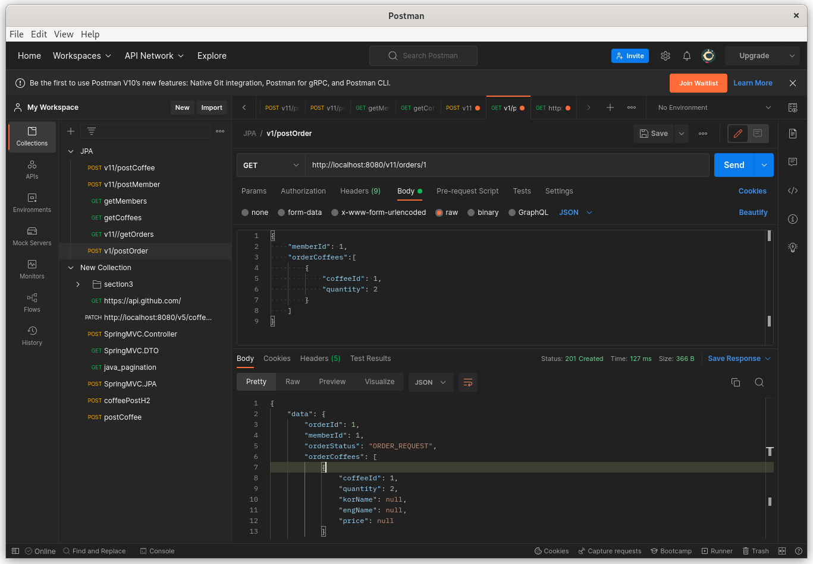

### 220901 줌세션 
- 
- JPA
    - ORM(Object Relational Mapping) 의 스펙 중 하나
- API 계층
- 데이터 액세스 계층
- 데이터 액세스 계층
    - 다음의 스펙이 있다.
    - JPA
    - hibernate ORM
    - JDBC API
      - 데이터베이스랑 통신

- 영속성 컨테스트(Persistence Context)
  - 1차 캐시
    - clear() remove()
    - em.persist()
  - 쓰기 지연 SQL 저장소(Entity 를 기반으로 SQL 쿼리문이 동적으로 생성된다.)
    - tx.commit()
  - em.find()
    - 1차캐시에서 먼저 조회하고, 없으면 DB dptj whghl
- 생각해볼 문제
  - EntityManager 와 Persist Context 의 관계
  - basic/em.persist(member)/SessionImple.java...타고 들어가다보면 EntityManager 나옴
- 책..김영한 저자 .. 732페이지 보면 
  - 토비의 스프링 저자랑 형제? 아무튼 묶어서 파는건 9만원 짜리 있음
- 인프런JPA 강의

- build.gradle 및 JPA 설정(application.yml) 확인

- JPA 의 동작 방식 리뷰

```java
//basic.Member.java 에서
    @Id
    @GeneratedValue(strategy = GenerationType.AUTO) // AUTO 는 오토인크리먼트, SEQUENCE , IDENTITY
    //SEQUENCE
    // 
    // IDENTITY
    //
```

- 위 전략 차이에 대해 정리된 글 https://gmlwjd9405.github.io/2019/08/12/primary-key-mapping.html

- 오라클에서는 기본 전략이 SEQUENCE 이고, 마이sql 이나 h2 등에서는 AUTO increment

- 질문 
```java
// A, B 두개의 백엔드 서버가 하나의 DB 서버를 바라보고 있을때 (현재 두개의 백엔드 서버의 영속성 컨텍스트의 1차 캐시는 모든 테이블을 가지고 있음) B서버가 특정 테이블에 데이터를 update 했고, A 서버가 그 update 된 필드를 select 했을때 A 서버의 영속성 컨텍스트 1차 캐시에는 B 서버가 update 하기 전의 데이터가 존재하므로, select한 데이터가 현재 DB의 데이터와 불일치가 일어나지 않나요? 
```

```java
// 영속성 컨텍스트에 1차 캐시가 비워지는 시점은 언제인가요? 정해져있나요? 
```
- 트랜잭션이 끝나는 시점

```java
// 두개의 엔티티를 매핑할때 다대다인데 코드를 List가 아닌 단일로 짜면 오류가 생기나요? 아니면 돌아가긴 하나요? 
```

- 백엔드 시스템.
  - HTML +javascript 로 화면을 만들어 보고 API 통신을 해보면 어떨까?
    - CSR
      - codestates-seb/be-reference-csr-client
      - codestates-seb/be-reference-csr-server
    - SSR 
      - codestates-seb/be-reference-advanced-ssr-server
    - 그냥 버틸 뿐. ..션


### 220902 줌 세션 
- 
- JSP Java Server Page
- JSP 는 사실 사양 기술임
  - 권장 안함
- JSP 만 배워서 입사지원할 때의 상황
  - 좋은 면접관 :바로 불합격
  - 호기심 많은 면접관: 면접 부른다>아부지 뭐하시노>불합격
  - -나쁜 면접관: 면접 부른다>JSP 로 몇달만 개발 좀 해줄수 있나?>합격>
    - 합격>야근,기술트렌드 관심없는 회사, 매출이 그때그때 다른 회사, 급여지급 불안감> 퇴사
- 우리는 JSP 가 아니고 API 개발임.
  - 정 SSR 하고 싶으면 타임리프, 머스태쉬 공부하는 게 좋다.
    - 나머지는 하지 마라. 부탁.

- entity 간 연관 관계 리뷰
- @OneToMany
  - 단독으로 잘 사용하지 않는 이유
  - onetomanyuni 실행해보면, 불필요한 update 쿼리가 로그에 보인다.
  - 
- @ManyToMany
  - 잘 사용하지 않는 이유
  - manytomanybi 실행 후 h2 테이블에서 실행하고 order_product 테이블 보면, 
- @ManyToOne(단방향/양방향)
  - 단방향(manytoOne-uni)
    - df
  - 양방향(manytoOne-bi)
    - 외래키, mapped by member 객체 자체. 이게 진짜 중요하다 
    - online.visual-paradigm.com/w/
    - 한명이 여러번 주문을 할수있지만 하나의 주문이 여려명한테 적용될수없다로 이해하면되는거죠? ... 그럼 양방향 단방향은 조회여부로 생각하면되나요? 
- 
- 이번 실습 과제의 난이도는 상,중,하, 중 중상 정도..
- 
- Auditable 상속하면, 

- Stamp

- ManytoOne 먼저 설정하고, 상대방에서 onetoMany mapped by 로 외래키 설정

- cascade 는?
  - 
- Builder 패턴
- CustomBeanUtils 설명

```java
//질문: onetoone매핑에서 어느 곳에 mappedby를 쓰고 어느곳에 joincolumn을 쓰는지 설명부탁드려도 될까요?? 
```

## 220902 금요일 수업 종료 후 공부

- jpa 폴더 안의 homework, template, reference 세 프로젝트를 열고 homework 프로젝트에 주로 실습하는 중.
- 

- 사진과 같이 postMember, postCoffee, postOrder 까지는 잘 작성되고 get 도 잘 되지만 
- getOrder 가 잘 안되었다.
- coffee와 member 는 자체 db(여기서는 cached,h2겠지만 아무튼)에 등록하지만 order 는 등록된 coffee member 데이터를 조회, 연결하는 방식이라 그런 것 같다.
- 처음 보고 이해가 안되는 자바 용법 검색하고 이해해보기.
```java
//Order.java
    @ManyToOne
    @JoinColumn(name = "MEMBER_ID")
    private Member member;

    // homework solution 추가
    @OneToMany(mappedBy = "order", cascade = CascadeType.PERSIST)
    private List<OrderCoffee> orderCoffees = new ArrayList<>();

```

```java
///Member.java
    @OneToMany(mappedBy = "member")
    private List<Order> orders = new ArrayList<>();

    // homework solution 추가
    @OneToOne(mappedBy = "member", cascade = {CascadeType.PERSIST, CascadeType.REMOVE})
    private Stamp stamp;

```
- 그니까 어제는 basic package 안에 직접 em.persist(), tx.commit() 등을 진행하였지만,
- 이번 과제는 그것을 안하고 애너테이션으로 해주는 대신 기존의 coffee,member,order 데이터 등과 연동하는 방법을 터득하는 것이 관건인 것 같다.
- 

```java
@EnableJpaAuditing
@SpringBootApplication
public class Spring32JPAhomeworkApp {

	public static void main(String[] args) {
//		System.setProperty("spring.profiles.active", "basic");
//		System.setProperty("spring.profiles.active", "table");
//		System.setProperty("spring.profiles.active", "column");
//		System.setProperty("spring.profiles.active", "id-direct");
//		System.setProperty("spring.profiles.active", "id-identity");
//		System.setProperty("spring.profiles.active", "id-sequence");
//		System.setProperty("spring.profiles.active", "one-to-many-uni");
//		System.setProperty("spring.profiles.active", "many-to-many-bi");
//		System.setProperty("spring.profiles.active", "many-to-one-uni");
//		System.setProperty("spring.profiles.active", "many-to-one-bi");

		SpringApplication.run(Spring32JPAhomeworkApp.class, args);
	}
}
```
```java
@EnableJpaAuditing
@SpringBootApplication
public class Be39Section3Week3HomeworkJpaApplication {

	public static void main(String[] args) {
		SpringApplication.run(Be39Section3Week3HomeworkJpaApplication.class, args);
	}

}
```
- 내일(토요일) 할것
  - psvm 실행 위치 관련, 
  - basic~many-to-one-bi 복습 및 공부
  - 그외 나머지
  - 알고리즘 리포지토리 생성하고 다시 풀기