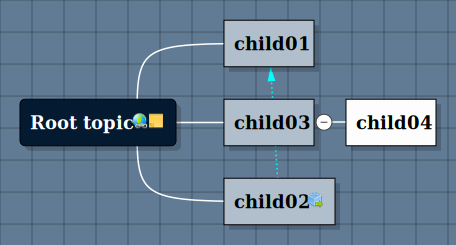

# 220903 복습

### 강한 결합, 약한 결합
```java
public interface Food {
    void eat();
}
```
```java
public class Chicken implements Food {
    @Override
    public void eat() {
        System.out.println("치킨을 먹습니다.");
    }
}
```
```java
public class Pizza implements Food {
    @Override
    public void eat() {
        System.out.println("피자를 먹습니다.");
    }
}
```
```java
public class Person {
    private Food food;

    public Person(Food food) {
        this.food = food;
    }

    public void startEat() {
        food.eat();
    }
}
```

### char, varchar, string
- 너무 깊게 들어가거나 정확한 표현이나 이미지 등으로 정리할 시간이 없어서 간단하게 정리
- string 은 자바의 클래스이다.
- 그리고 흔히 int, long(sql 의 bigint), short 등이 primitive 인것같다.
- 단순하게는 varchar(50) 는 가변 길이에 50자리 글자, 50byte 메모리 차지한다고 생각하자
- 2^8(8bit)=256*2 2^16(16bit)=65536 이것만 일단 기억하고 나중에 나무위키에서 이 둘을 읽어보자.

## be-template-jdbc

- 데이터 액세스 기술 : mybatis, Spring JDBC, Spring Data JDBC, JPA, Spring Data JPA 등
- 인메모리 DB 인 H2 를 사용하기 위해 다음 작성
- template/message
```yml
spring:
  h2:
    console:
      enabled: true
      path: /h2     # (1) Context path
  datasource:
    url: jdbc:h2:mem:test     # (2) JDBC URL
  sql:
    init:
      schema-locations: classpath*:db/h2/schema.sql
      data-locations: classpath*:db/h2/data.sql
```
Spring Data JDBC 적용 순서

Hello World 샘플 코드를 통해서 Spring Data JDBC를 어떻게 사용하는지 대략적으로 감이 올거라 생각합니다.

마지막으로 코드 상에서 실제 어떤 순서대로 Spring Data JDBC 기술을 적용하면 좋을지 다시 한번 정리를 하겠습니다.

    build.gradle에 사용할 데이터베이스를 위한 의존 라이브러리를 추가합니다.
    application.yml 파일에 사용할 데이터베이스에 대한 설정을 합니다.
    ‘schema.sql’ 파일에 필요한 테이블 스크립트를 작성합니다.
    application.yml 파일에서 ‘schema.sql’ 파일을 읽어서 테이블을 생성할 수 있도록 초기화 설정을 추가합니다.
    데이터베이스의 테이블과 매핑할 엔티티(Entity) 클래스를 작성합니다.
    작성한 엔티티 클래스를 기반으로 데이터베이스의 작업을 처리할 Repository 인터페이스를 작성합니다.
    작성된 Repository 인터페이스를 서비스 클래스에서 사용할 수 있도록 DI 합니다.
    DI 된 Repository의 메서드를 사용해서 서비스 클래스에서 데이터베이스에 CRUD 작업을 수행합니다.

- MySQL 이나 MariaDB 사용방법은 나중에 별도로 실습하자.

- 배달 주문 앱 도메인 : 회원, 음식, 주문, 결제
  - Aggregate, Aggregate Root
    - 관계형DB(RDBM) 에서 A테이블의 기본키를 B테이블이 가지고 있다면
    - B는 A 테이블의 자식테이블이라고 하고
    - B가 가지고 있는 A 의 기본키를 외래키라 함
  - 1:N, N:1, N:N
    - 
  - 주문 테이블 이름은 order 가 아닌 orders. sql 에서 order by 라는 예약어가 있으므로
- 테이블 간에는 외래키로 연결, 클래스 간에는 객체 참조로
- member, coffee, orders 등 각 애그리거트 내에서는 엔티티 간의 객체로 참조한다.
- 애그리거트 루트 간의 참조는 객체 참조 대신 ID 로 참조한다.
  - 1:1 과 1:N - 테이블 간의 외래키 ID방식
  - N:N 일때는 ID참조와 객체 참조 방식이 함께 사용됨

### 도메인 엔티티 클래스 정의 

- application.yml schema.sql 파일 내용을 보면서 다음 코드를 살펴보자.
```java
// Order.java
...
import com.codestates.member.entity.Member;
import lombok.Getter;
import lombok.Setter;
import org.springframework.data.annotation.Id;
import org.springframework.data.jdbc.core.mapping.AggregateReference;
import org.springframework.data.relational.core.mapping.Table;
...
...

@Getter
@Setter
@Table("ORDERS")  // (1)
public class Order {
    // (2)
    @Id
    private long orderId;

    // (3) 테이블 외래키처럼 memberId를 추가해서 참조하도록 한다.
    private AggregateReference<Member, Long> memberId;

    ...
		...
}
```

- @Table("ORDERS") 애너테이션을 추가하지 않으면 클래스명이 테이블의 이름과 자동으로 매핑된다.
  - 다만 order 는 예약어이므로 추가한 것이다.
- Apparently, Member class is the root of member aggregate, and Order class is the root of order aggregate.
- (3) Member 와 Order 는 1:N 이므로 외래키로 참조하는데, 저렇게 AgrregateReference class 로 감싸서 참조하면 Member 자체 참조가 아닌 ID 참조가 된다.


- 이제 N:N 관계인 Order 와 Coffee 를 보자.
```java
//Coffee.java
import lombok.AllArgsConstructor;
import lombok.Getter;
import lombok.Setter;
import org.springframework.data.annotation.Id;

@Getter
@Setter
public class Coffee {
    // (1)
    @Id
    private long coffeeId;
    private String korName;
    private String engName;
    private int price;
    private String coffeeCode;  // (2) 추가된 컬럼
}
```

- 그리고 Order 에서 Coffee 와 매핑하기 위해     @MappedCollection(idColumn = "ORDER_ID")
  private Set<CoffeeRef> orderCoffees = new LinkedHashSet<>();
- 와 같이 작성하여 생성하였다
- schema.sql 안에 order_coffee 테이블을 보면, primary key 없이 foreign key 만 있는 것을 볼 수 있다.
- order aggregate 안에 CoffeeRef 클래스를 생성하여 order_coffee 테이블을 매핑해주었다. 이때 이름은 CoffeeRef 가 아닌 order_coffee 등 어떤 걸 해도 상관없다.

- 아무튼 order 와 coffee 처럼 N:N 연관관계 매핑은 다소 복잡해보이는데, 정리하면 다음과 같다.
  1. N:N -> 1:N, N:1 관계로 변경
  2. 1:N:1

### 서비스, 리포지토리 구현 

- MemberService.java
- 참고 블로그 https://mangkyu.tistory.com/70
- 리포지토리: JDBC, JPA 에서 db 와 상호작용 역할을 하는 인터페이스
  - MemberRepository, CoffeeRepository
- MemberService.java 에 작성한 새로 배운 코드(복습 필요)
  - Optional.ofNullable()
    - Optional.of() 대신 사용해 클라이언트에서 phone 이나 name 중에서 선택적으로 변경하는 경우에 대비, null 이 아니라면 ifPresent() 내 코드가 작성되고, null 이면 아무 동작도 하지 않게 설정
  - crudeRepository 의 findAll() 리턴값이 Iterable<T> 이므로 List<Member> 로 캐스팅했다.
  - 여기서는 학습을 위해 회원 정보 자체를 삭제했지만 실무에서는 그보다는 member_status 같은 상태값만 변경한다. 이 프로젝트에서는 order entity 에 작성되어 있다.
  - findVerifiedMember 에서는 null 이 아니면 해당 객체를 리턴하고 null 이면 해당 예외를 던진다.

- CoffeeService.java
- OrderService.java
- 를 순서대로 작성하였고, 각각 다시 보고 공부할 내용이 많다.

## 20220904 일요일 JDBC 복습 완료 그런데..
- 인텔리제이에서 project structure/module setting 과 settings.gradle 내의 이름을 같이 변경해주었다.
- 그리고 전부 be-homework-JDBC, be-reference-JDBC, be-template-JDBC 등으로 이름을 통일하였고 그 세가지를
springJDBC 라는 이름의 빈 프로젝트를 먼저 생성하고 그 안에서 임포트 모듈 방식으로 세개를 한 프로젝트 안에서 실행하게 구성하였다.
- 점점 더 코드의 양이 많아서 토요일에는 JDBC 의 실습을 template 안에 몇시간 동안 작성하였었는데 오늘 모듈구성을 변경하고 다시 실행해보니 이해할 수 없는 클래스 경로 에러가 떠서 한동안 쩔쩔매다가 그냥 포기했다..
다행히 reference 와 homework 는 살아있어서 실행하였고 postman 에 http 요청 등록 후 정상 작동 확인 후 저장.
- 그리고, section3 는 spring 입문부터 API, DB, 마지막 빌드 및 배포까지 순서대로 배우도록 되어있는데, stendhalgame 도 H2 로 구성되어있어서 곧 분석할 수 있을 줄 알았지만 시간적으로 힘들 것 같고,
일단 마지막 빌드/실행/배포 부분 을 미리 테스트 라도 해보자. 
- 그리고 오늘 남은 시간 동안 다음 페어 확인, 과제 확인 후 JPA 도 복습해야 한다.
- 아직은 springBuild 리포가 안열렸으므로 stendhal 을 해보자. 그 전에, JSP, Thymeleaf, mustache 등 알아보고 간단하게라도 테스트 해보자.

## 지금 java, Spring, 심지어 intelliJ module setting 가지고 어렵고 짜증나고 해깔리는 것 등등, 당장은 도저히 믿기 어렵지만 몇달, 또는 1년만 지나면 '그때는 그랬었지..' 라고 생각할 때가 올 것임을 분명히 기억하고 마음 편하게 하자.
- 2년전 처음 우연히 리눅스를 썼을 때, kvm을 구성하였을 때, btrfs 와 백업 구성, 우분투부터 페도라까지..지금 이렇게 편하고 좋아하게 되고 kvm 세팅은 물론 스스로 효율적인 멀티부트 구성까지..
- 그리고 불과 1달 전 멀티부트가 서로 간에 grub 과 boot/efi 등을 꼬는 문제, 등등 수많은 것 때문에 머리아프고 고생했지만 지금은 내 나름대롤의 기준을 세웠고 너무 편하게 만족하고 사용하고 있다는 것을 기억하자..
- 당장은 너무 힘들고 며칠밤 새기도 하고 등등 그렇지만 2년전, 1년전에는 이렇게 리눅스가 편하고 좋아하게 될줄 전혀 몰랐다.
- 아무튼..힘내자..백엔드40기..
- 아 그리고 그건 아직 해결하지 못했지만 약 1~2달 전부터 브라우저렌더링과 프론트엔드 부분에 관심이 생겨서 진도도 제대로 못하면서 거기에 빠져서 고생했던 것..이것도 언젠가는 잘 해낼 수 있을 것이다.

## JSP, Thymeleaf, Mustache
- ㄴㅇ

| sasdf | df                                                          | asfdf |
| --- |-------------------------------------------------------------|-------|
| [Spring] 백엔드 신입 포트폴리오 개발 순서 | https://developer-rooney.tistory.com/201                    | ㅇ     |
| netbeans-mmd-plugin | https://www.igormaznitsa.com/netbeans-mmd-plugin/#downloadv |   https://github.com/raydac/netbeans-mmd-plugin    |
||||
||||
||||


| 제목 | 내용   |  
| --- |------|  
| ㄷㄹㄷㄹ | ㄷㄹㄷㄹ |  
| ㄷㄹㄷ | ㄷㄹ   |  





